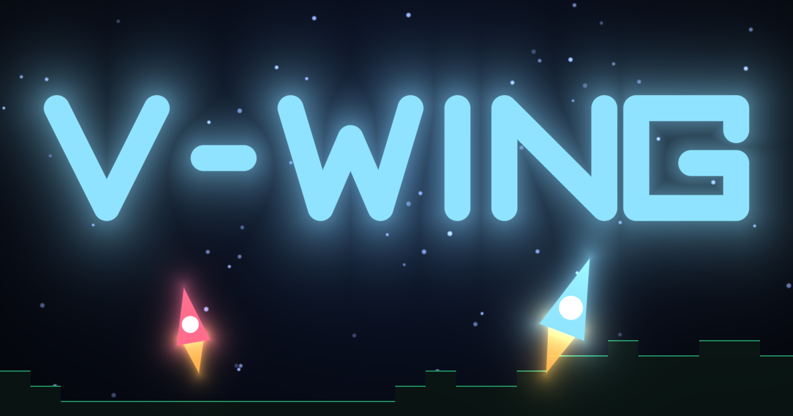

# V-Wing

<!-- docs/og-image.png is the PWA share card baked by `bun run build` (scripts/pwa/artwork.ts);
     re-copy it from dist/ when the artwork changes. -->
[](https://mccall.kapsi.fi/vwing/)

[](https://relicode.github.io/vwing/)
[](https://bun.sh)
[](https://pixijs.com)
[](https://react.dev)
[](https://unlicense.org)

> [!NOTE]
> **[▶ Play the demo](https://relicode.github.io/vwing/)** runs the offline campaign (you vs. the
> bot), deployed from `main` to GitHub Pages. Pages is static hosting, so the online lobby is dark
> there — run the server locally (see [Quick start](#quick-start)) for multiplayer.

A collision of two beloved old genres: the **2D gravity dogfighter** — its DOS-era namesake
[V-Wing](https://classicreload.com/v-wing.html), [XPilot](https://en.wikipedia.org/wiki/XPilot) —
and the **god game of wilful little people** in the
[Populous II](https://en.wikipedia.org/wiki/Populous_II:_Trials_of_the_Olympian_Gods) /
[Settlers](https://en.wikipedia.org/wiki/The_Settlers) /
[Dungeon Keeper](https://en.wikipedia.org/wiki/Dungeon_Keeper) tradition. You get direct control
of exactly one thing: your ship. Everything that actually wins the war walks.

## The arena

The flying is honest Newtonian business — thrust, rotation, inertia, a constant pull of gravity —
over a large **destructible voxel-terrain** arena of grasslands, rock, caves, ice, seas and
floating sky isles. Fire carves the world: craters, falling debris, water that pools into basins,
grass that burns in a creeping front and grows back. Each life rolls a random secondary weapon
(scattergun, water cannon, flamethrower, seeker, rail, grenades, mines, flak, EMP, singularity)
off a recharging energy bar.

## The troopers

**They are the heart of the game, and they do not take orders.** Land on your barracks pad and they
board on their own short legs; paradrop them where you think the war is, and that is the last
instruction they accept. From there they patrol, take cover, kneel to fire, slip on ice, and swim
with more courage than skill. Most are riflemen; one in five shoulders a man-portable version of
the squad's heavy weapon. Your job is logistics and rescue — ferry them forward, fish swimmers out
before they drown, recruit the enemy's by slow, patient contact — until your infantry storms the
enemy barracks. Respawns are free but each one takes a little longer; lose every base your side
holds and the next death is the last.

## Modes

- **Campaign** *(offline)* — you against an AI bot playing the same game you are: rearming,
  assaulting and defending with a ship and wilful infantry of its own. No server needed.
- **Multiplayer** *(online)* — a server-authoritative deathmatch over WebSockets: no barracks, no
  babysitting, just the dogfight.

## Look & feel

The graphics are hand-built **procedural vector art** — no sprite sheets; every ship and soldier is
drawn from code — but the *spirit* is borrowed wholesale from the golden age of tiny, characterful
crowds:

- the big-headed commandos take their stance and swagger from
  [**Cannon Fodder**](https://en.wikipedia.org/wiki/Cannon_Fodder_(video_game));
- their helpless-but-determined scurrying — and their readiness to drown — nods to
  [**Lemmings**](https://en.wikipedia.org/wiki/Lemmings_(video_game));
- and the busy little home-base economy owes its bustle to
  [**The Settlers**](https://en.wikipedia.org/wiki/The_Settlers).

## Built with

[PixiJS](https://pixijs.com) (WebGL) for the game canvas and **[React](https://react.dev) + MUI**
for the shell (title, lobby, HUD, game-over). Bundled and served by [Bun](https://bun.sh); linted
by [Biome](https://biomejs.dev) and type-checked by `tsc`.

## Quick start

```sh
bun install
bun run dev      # web client on :3110 — practice vs. the bot needs no server
bun run dev:all  # web client + game server (:8787) for online play
```

### Controls

| Action | Keys |
| ------ | ---- |
| Rotate | `←` `→` |
| Thrust | `↑` |
| Retro-brake | `↓` |
| Fire (main weapon) | `D` |
| Secondary weapon | `S` |
| Deploy troops | `A` |

> [!TIP]
> Your best campaign score is saved to `localStorage`.

## Scripts

| Script | What it does |
| ------ | ------------ |
| `bun run dev` | Dev server for `src/index.html` with hot reload (`:3110`) |
| `bun run server` | Authoritative game server (Bun WebSocket, `:8787`; Redis state if available, in-memory fallback) |
| `bun run dev:all` | Both of the above, labelled `vwing:web` / `vwing:srv` |
| `bun run redis` | Just the Redis container (loopback `:6379`) for the host dev loop to share |
| `bun run stack` | Full Docker stack (app + Redis + Traefik) on `http://localhost` — see [Docker](#docker--self-host) |
| `bun run stack:down` / `stack:logs` | Tear down / tail the dev stack |
| `bun run stack:prod` | Production stack with TLS (`compose.prod.yaml`; needs `APP_DOMAIN` + `ACME_EMAIL`) |
| `bun run build` | Production bundle into `dist/` |
| `bun run preview` | Serve the built `dist/` (`:3111`; run `build` first) |
| `bun run release <major\|minor\|patch>` | Cut a release with git-flow: bump the version, merge to `main`, tag, back-merge (prompts first; `--dry-run` to preview). Add `--push` to push the tag, which fires `release.yml` to publish the GitHub Release |
| `bun test` | Unit tests for the pure simulation logic |
| `bun run lint` | `biome check` + `tsc --noEmit` (concurrent) |
| `bun run format` | `biome check --write` (format + lint fixes + import sort) |
| `bun run chrome` | Headless Chrome on the dev URL, CDP on `:9222` (visual QA) |
| `bun run git:feature:finish` | `git flow feature finish --no-ff` |

## Development

**Prerequisites:** [Bun](https://bun.sh) ≥ 1.3.13 is the whole toolchain — runtime, bundler, test
runner, and package manager (no Node, Vite, or webpack). [Redis](https://redis.io) is optional; the
server keeps state in memory without it.

Keep both green before every commit:

```sh
bun run format   # Biome: format, import sort, and safe lint fixes
bun run lint     # biome check + tsc --noEmit (run concurrently)
bun test         # the pure-simulation unit suite (never imports PixiJS or touches the DOM)
```

- **Branching** follows [git-flow](https://github.com/petervanderdoes/gitflow-avh) off `develop`
  (`feature/` `bugfix/` `release/` `hotfix/`). Finish a feature with `bun run git:feature:finish`
  (`git flow feature finish --no-ff`).
- **Dev ports** live in the `31xx` block so a sibling dev server never collides and browsers keep
  the PWA/`localStorage` origins separate: web client `3110` (`$VWING_WEB_PORT`), `preview` `3111`,
  game server `8787` (`$PORT`). `dev:all` labels the two processes `vwing:web` / `vwing:srv`.
- **Imports** use the `$/*` → `src/*` alias (`tsconfig.json` paths); Bun and Biome both honor it.
- **Browser inspection:** `bun run chrome` opens the dev URL in headless Chrome with a CDP endpoint
  on `localhost:9222` (for DevTools, the chrome-devtools MCP, or scripted CDP); `bun run
  chrome:visual` opens a real window on `9223`. Start the dev server first.

### Docker / self-host

The repo ships a Compose stack — the Bun server (HTTP + static client + the `/ws` socket all on
one port) behind [Traefik](https://traefik.io), with Redis for authoritative state:

```sh
bun run stack       # docker compose up -d --build → http://localhost
bun run stack:logs  # tail it;  bun run stack:down to stop
```

- **`compose.yaml`** is the production-safe base: only Traefik publishes a host port (`80`), and
  Redis sits on an internal-only network — no host port, no egress, unreachable by anything but the
  app. Because HTTP and the WebSocket share one origin, the proxy carries both.
- **`compose.override.yaml`** is auto-loaded by `docker compose up` and publishes Redis on
  `127.0.0.1:6379` so a host-side `bun run dev:all` can share the store (run one *or* the other
  against it, not both). Redis persists to the `./data` bind-mount.
- **`compose.prod.yaml`** is the explicit TLS override: `bun run stack:prod`
  (`-f compose.yaml -f compose.prod.yaml`, so the dev override is *not* loaded → still only Traefik
  exposed). Set a real `APP_DOMAIN` (public DNS → this host) **and** uncomment `ACME_EMAIL` in
  `.env` first — the prod config aborts without it, and Let's Encrypt needs inbound `:443`. Tear it
  down with the matching files: `bun run stack:prod:down`.

Copy `.env.example` → `.env` (Compose reads it automatically); never set `NODE_ENV=production`
there — it would leak into the dev bundle and misroute the client.

### Releases & CI

`bun run release <major|minor|patch>` cuts a version with git-flow (bump → merge to `main` → tag →
back-merge to `develop`); add `--push` to push the tag. Two workflows then run:

- pushing the tag fires [`release.yml`](./.github/workflows/release.yml) — it builds the bundle,
  attaches it, and publishes the GitHub Release with generated notes;
- pushing `main` fires [`deploy-demo.yml`](./.github/workflows/deploy-demo.yml) — it redeploys the
  offline demo to GitHub Pages.

## How it works

- **`src/game/`** — the simulation: pure, framework-free TypeScript. Newtonian flight (`ship`),
  voxel terrain with carving/debris/water (`voxel`, `terrain-map`, `water`), troopers and their
  state machine (`devices`, `troops`), barracks and capture (`bases`), the bot's goal layer
  (`bot`), weapons/bullets/beams, and a seeded RNG so every run is deterministic and testable.
  The same sim steps headlessly on the server — nothing in it touches the DOM or PixiJS.
- **`src/game/render/` + `view.ts`** — the PixiJS presentation: camera-offset world layer,
  parallax stars, procedural vector art for ships and the big-headed troopers, minimap.
- **`src/net/` + `src/server/`** — the JSON WebSocket protocol, the thin snapshot-drawing client,
  and the authoritative Bun server (rooms, lobby, Redis-or-memory state).
- **`src/app/`** — the React + MUI shell: boots the engine or net client, mounts its canvas, and
  renders HUD and menus on top.

## More

See [`CLAUDE.md`](./CLAUDE.md) for architecture and conventions, and [`PLAN.md`](./PLAN.md) for the
record of the presentation layer's migration to PixiJS v8 built-ins.
